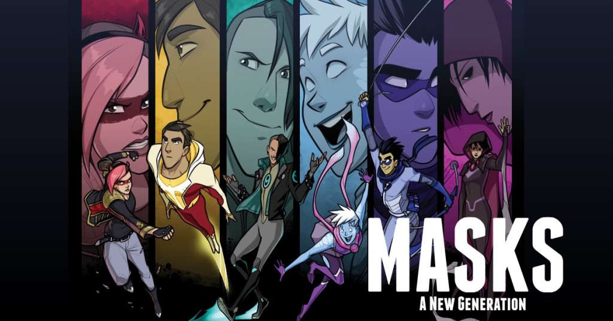

# Masks: A New Generation (Unofficial) На русском!

Этот модуль содержит ходы для игры Masks: A New Generation для использования с системой Foundry VTT generic PbtA System (https://gitlab.com/asacolips-projects/foundry-mods/pbta). Вы можете установить данную систему по этой ссылке: https://gitlab.com/asacolips-projects/foundry-mods/pbta/-/jobs/artifacts/beta/raw/system.json?job=build-beta

Содержание этого модуля взято из **Masks: A New Generation** от **Magpie Games**. Вы можете приобрести PDF по адресу: https://magpiegames.com/masks/

Эта доработанная версия модуля основана на версии  CyricPL (https://github.com/CyricPL/masks-newgeneration-unofficial). В данной версии модуля, вы найдёте неофициальный перевод текста ходов и некоторые дополнения, сделанные для улучшения игрового опыта в Маски на русском языке.

Compendium Folders (https://raw.githubusercontent.com/earlSt1/vtt-compendium-folders/master/module.json) всё ещё является необходимым для использования модуля, если он у вас не установлен, то при установке системы Foundry потребует от вас установить Compendium Folders. 

  

# Установка

## Ручная установка
1. Откройте **modules** и используйте ссылку: https://raw.githubusercontent.com/Milkhare/masks-unofficial-russian/main/module.json

# Шаблоны
Перед импортом компендиума необходимо установить шаблон. Вы можете использовать два шаблона:
- Normal sheet: https://raw.githubusercontent.com/Milkhare/masks-unofficial-russian/main/templates/masks.txt
- Harm sheet: https://raw.githubusercontent.com/Milkhare/masks-unofficial-russian/main/templates/masks_harm.txt

# Что с этим делать?
1. Выберите шаблон и загрузите его в настройки вашей игры PbtA.
2. Активируйте модуль.
3. Импортируйте нужный компендиум в ваш мир.
4. Переместите необходимые папки на лист персонажа.

# Больше интрукций
Внутри есть журнал, в котором вы можете найти больше инструкций для комфротной игры в Маски.

# Changelog
Вы можете посмотреть историю изменений в [CHANGELOG](CHANGELOG.md)

# License
The entire text of Masks is released under a Creative Commons Attribution 4.0 International license. https://creativecommons.org/licenses/by/4.0/
Icons from game-icons.net are released under a Creative Commons Attribution 3.0 Unported license. https://creativecommons.org/licenses/by/3.0/
This work uses material from The Innocent, The Joined, The Newborn, The Reformed, and The Star, published by Magpie Games in the Halcyon City Herald Collection and written by Brendan Conway, Jenn Martin, Tim Franzke and Alberto Muti, June Shores, and Brendan Conway, respectively, and is licensed under the Creative Commons Attribution 4.0 International license. http://creativecommons.org/licenses/by/4.0/
